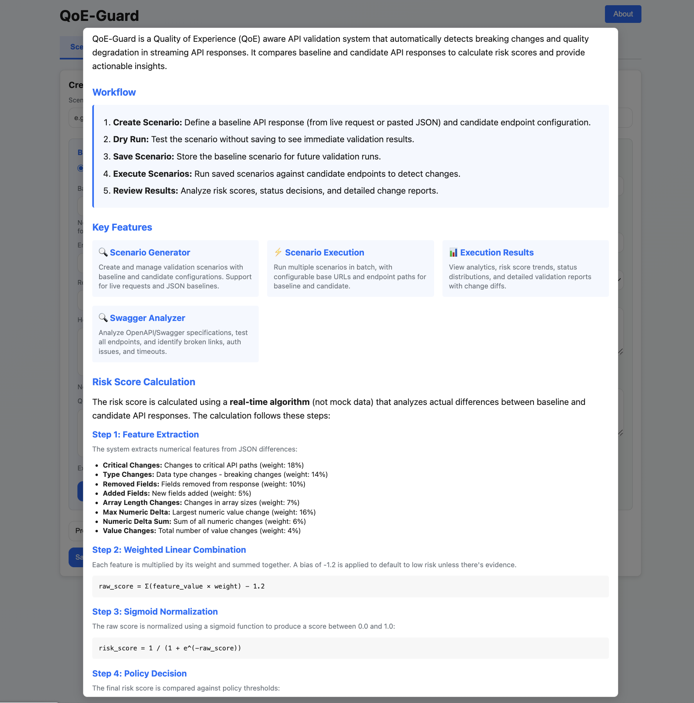
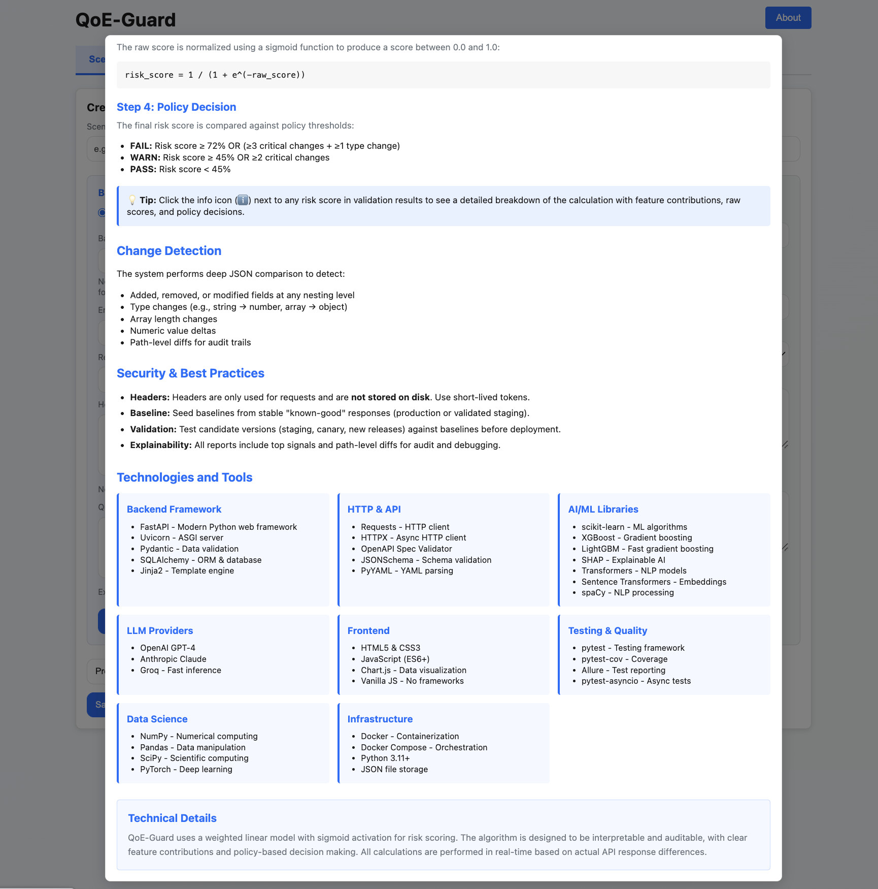
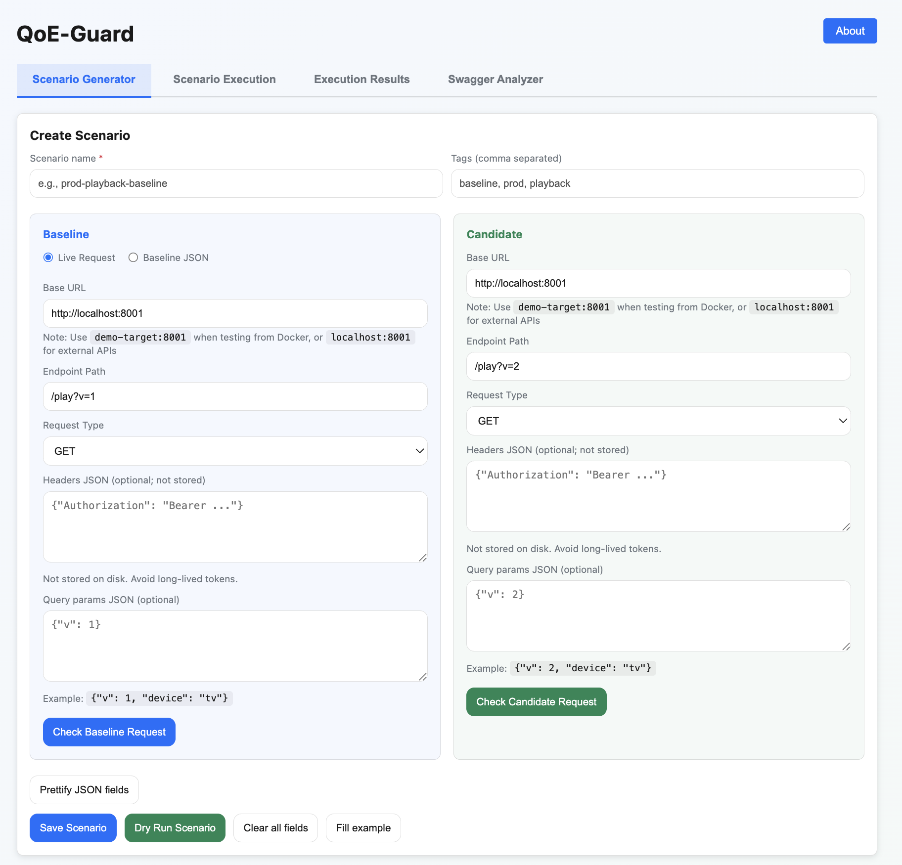
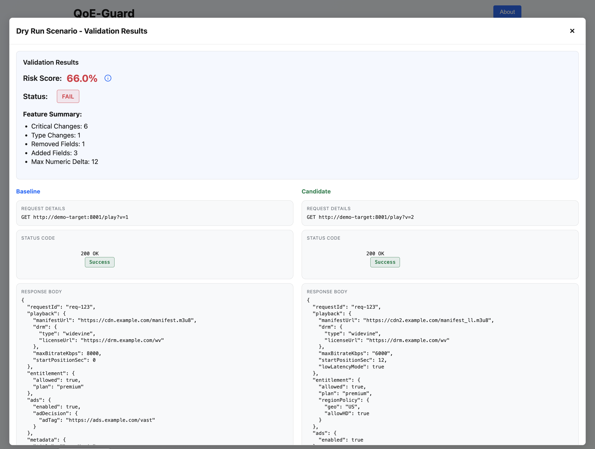
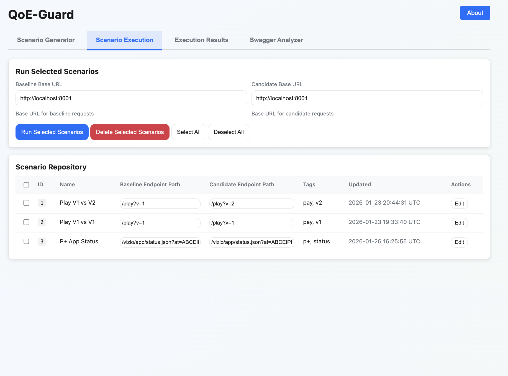
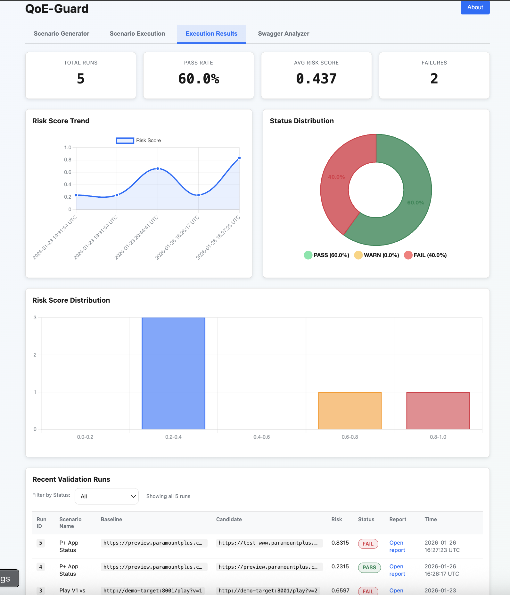
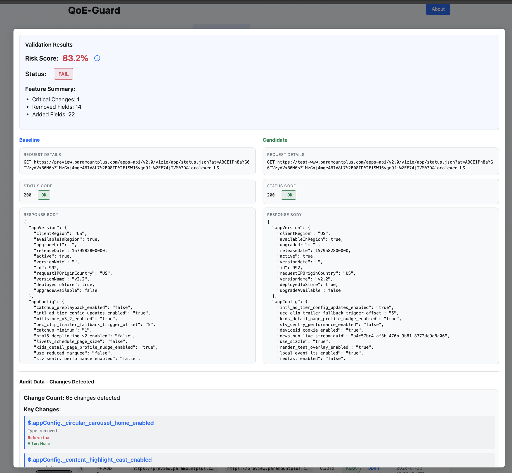
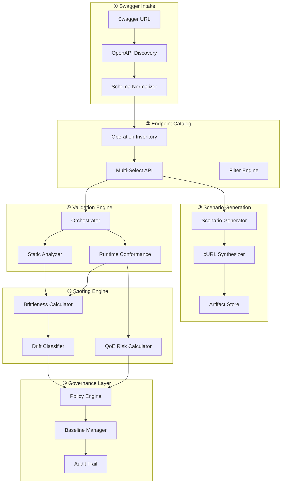

# QoE-Guard Enterprise

<div align="center">


**Intelligent API Validation with Brittleness Scoring & QoE-Aware CI Gating**

[](https://github.com/parthassamal/qoe-guard-patent-demo/actions)
[](https://www.python.org/)
[](LICENSE)
[](htmlcov/)

[**Quick Start**](#-quick-start) • [**Features**](#-key-features) • [**Architecture**](#-system-architecture) • [**API Reference**](#-api-reference) • [**Roadmap**](#-future-roadmap)

</div>

---

## 📋 Executive Summary

**QoE-Guard** is an enterprise-grade API validation platform that transforms OpenAPI/Swagger specifications into executable validation scenarios. Unlike traditional contract testing tools, QoE-Guard introduces **novel scoring algorithms** that quantify:

| Metric | What It Measures | Innovation |
|--------|------------------|------------|
| **Brittleness Score** (0-100) | Likelihood of consumer breakage | Multi-signal fusion: static + runtime + change sensitivity |
| **QoE Risk Score** (0.0-1.0) | Impact on end-user experience | Domain-aware criticality weighting (playback, DRM, ads) |
| **Drift Classification** | Type of API deviation | Distinguishes spec drift vs runtime drift vs undocumented changes |

> **Patent-Pending Technology**: This system implements six novel inventive concepts not found in existing API testing solutions.

---

## 🚀 Quick Start

### One-Command Setup

```bash
# Clone, setup, and run in 30 seconds
git clone https://github.com/parthassamal/qoe-guard-patent-demo.git
cd qoe-guard-patent-demo
python3 -m venv .venv && source .venv/bin/activate
pip install -r requirements.txt
python -m qoe_guard.main
```

**Open http://localhost:8010** — You're ready to validate APIs!

### Application Interface

The QoE-Guard web interface provides four main tabs:

- **Scenario Generator**: Create validation scenarios with baseline and candidate configurations
- **Scenario Execution**: Manage and execute saved scenarios with batch operations
- **Execution Results**: View analytics, risk scores, and detailed validation reports
- **Swagger Analyzer**: Analyze OpenAPI/Swagger specifications for endpoint health

Click the **About** button in the top-right corner for detailed information about workflows, features, risk score calculation, and technologies used.

### Alternative: Docker

```bash
docker-compose up
# App: http://localhost:8010 | Demo API: http://localhost:8001
```

---

## ✨ Key Features

<table>
<tr>
<td width="50%">

### 🔍 Intelligent Analysis
- **Swagger → Executable Pipeline**: Auto-discover OpenAPI specs
- **Multi-Select Orchestration**: Validate multiple endpoints in parallel
- **Schema Conformance**: JSON Schema validation with detailed errors
- **Swagger Analyzer**: Test all endpoints for broken links, auth issues, and timeouts

</td>
<td width="50%">

### 🧠 AI-Powered Insights
- **LLM Explanations**: GPT-4, Claude, Groq integration
- **Semantic Drift Detection**: Detect field renames via embeddings
- **Anomaly Detection**: Isolation Forest for runtime outliers
- **Real-Time Risk Calculation**: Live algorithm-based scoring (not mock data)

</td>
</tr>
<tr>
<td width="50%">

### 📊 Quantified Risk
- **Brittleness Scoring**: 4-family signal fusion (0-100)
- **QoE Risk Scoring**: Domain-weighted impact (0.0-1.0)
- **Drift Classification**: Spec / Runtime / Undocumented
- **Interactive Risk Details**: Modal with detailed calculation breakdown

</td>
<td width="50%">

### 🏛️ Enterprise Governance
- **Baseline Management**: Versioned with promotion workflows
- **Audit Trail**: Complete change history with approvals
- **Policy Engine**: Configurable thresholds and CI gates
- **Batch Scenario Execution**: Run multiple scenarios with configurable base URLs

</td>
</tr>
</table>

### 🖥️ User Interface

The application features a modern, tab-based interface with four main sections:



1. **Scenario Generator** - Create validation scenarios with:
   - Baseline and Candidate request configurations
   - Support for live requests or JSON baselines
   - Dry run capability for immediate testing
   - Scenario editing functionality



2. **Scenario Execution** - Manage and execute scenarios:
   - Scenario Repository with integer IDs (starting from 1)
   - Baseline Base URL and Candidate Base URL configuration
   - Individual Baseline and Candidate Endpoint Paths per scenario
   - Checkbox selection for batch operations
   - Run Selected Scenarios and Delete Selected Scenarios actions


3. **Execution Results** - View validation outcomes:
   - Analytics dashboard with risk score trends
   - Status distribution charts
   - Detailed validation reports in modal overlays
   - Baseline and Candidate URLs with full path information
   - Interactive risk score details with calculation breakdown



4. **Swagger Analyzer** - Analyze OpenAPI specifications:
   - Multiple input methods: From URL, Upload JSON File, or Load Sample
   - Sample Swagger JSON loader with comprehensive test endpoints
   - Endpoint health analysis (Healthy, Broken, Auth Required, Tested)
   - Recommendations for API improvements
   - Direct JSON content support (no need for accessible URLs)
   - Endpoint testing with configurable base URLs and headers


---

## 🔄 Application Workflow

### Step-by-Step Process

1. **Create Scenario** (Scenario Generator Tab)
   - Define scenario name and tags
   - Configure Baseline request (from live API or paste JSON)
   - Configure Candidate endpoint (URL, path, headers, params)
   - Use "Dry Run" to test without saving
   - Save scenario for future use

2. **Execute Scenarios** (Scenario Execution Tab)
   - View all saved scenarios in the repository
   - Configure Baseline Base URL and Candidate Base URL at the top
   - Select scenarios using checkboxes
   - Each scenario has individual Baseline and Candidate Endpoint Paths
   - Click "Run Selected Scenarios" to execute batch validation

3. **Review Results** (Execution Results Tab)
   - View analytics dashboard with risk score trends
   - See status distribution (PASS/WARN/FAIL)
   - Click "Open Report" to view detailed validation results in modal
   - Click info icon (ℹ️) next to risk score to see calculation details
   - Review Baseline and Candidate URLs with full paths

4. **Analyze Swagger** (Swagger Analyzer Tab)
   - Choose input method: From URL, Upload JSON File, or Load Sample
   - Load sample Swagger JSON to test analyzer capabilities
   - Configure base URL, headers, and timeout
   - Analyze endpoints for health status (Healthy, Broken, Auth Required)
   - Review recommendations and endpoint details

### Key UI Features

- **About Modal**: Comprehensive information about workflows, features, risk calculation, and technologies
- **Edit Scenario**: Update scenario details including baseline and candidate endpoint paths
- **Batch Operations**: Select multiple scenarios and run or delete them together
- **Interactive Modals**: Detailed reports and risk calculations displayed in overlay modals
- **Real-Time Scoring**: Risk scores calculated using actual algorithm (not mock data)

---

## 🏗️ System Architecture

### High-Level Overview

```
┌─────────────────────────────────────────────────────────────────────────────┐
│                           QoE-Guard Enterprise                              │
├─────────────────────────────────────────────────────────────────────────────┤
│                                                                             │
│   ┌───────────┐    ┌───────────┐    ┌───────────┐    ┌───────────┐        │
│   │  Swagger  │    │  Endpoint │    │  Scenario │    │ Validation│        │
│   │  Intake   │───▶│  Catalog  │───▶│ Generation│───▶│  Engine   │        │
│   └───────────┘    └───────────┘    └───────────┘    └───────────┘        │
│         │                                                   │              │
│         ▼                                                   ▼              │
│   ┌───────────┐                                      ┌───────────┐        │
│   │  OpenAPI  │                                      │  Scoring  │        │
│   │  Parser   │                                      │  Engine   │        │
│   └───────────┘                                      └───────────┘        │
│                                                            │              │
│                           ┌────────────────────────────────┤              │
│                           ▼                                ▼              │
│                    ┌───────────┐                    ┌───────────┐        │
│                    │  Policy   │                    │ Governance│        │
│                    │  Engine   │                    │   Layer   │        │
│                    └───────────┘                    └───────────┘        │
│                           │                                              │
│                           ▼                                              │
│                    ┌───────────┐                                         │
│                    │  CI Gate  │  ──▶  PASS / WARN / FAIL               │
│                    └───────────┘                                         │
│                                                                          │
└──────────────────────────────────────────────────────────────────────────┘
```

### Component Architecture (Mermaid)



---

## 📐 Scoring Algorithms

### Brittleness Score (0-100)

Quantifies the likelihood of consumer breakage through **multi-signal fusion**:

```
┌─────────────────────────────────────────────────────────────────┐
│                    BRITTLENESS SCORE                            │
├─────────────────────────────────────────────────────────────────┤
│                                                                 │
│   Contract Complexity (25%)     Change Sensitivity (30%)        │
│   ┌─────────────────────┐       ┌─────────────────────┐        │
│   │ • Schema depth      │       │ • Removed fields    │        │
│   │ • Union types       │       │ • Type changes      │        │
│   │ • Required fields   │       │ • Enum changes      │        │
│   │ • Parameter count   │       │ • Requiredness Δ    │        │
│   └─────────────────────┘       └─────────────────────┘        │
│            │                              │                     │
│            └──────────────┬───────────────┘                     │
│                           ▼                                     │
│   Runtime Fragility (25%)       Blast Radius (20%)              │
│   ┌─────────────────────┐       ┌─────────────────────┐        │
│   │ • Timeout rate      │       │ • Tag criticality   │        │
│   │ • 5xx error rate    │       │ • Environment       │        │
│   │ • Latency variance  │       │ • Dependency count  │        │
│   │ • Schema mismatches │       │ • Consumer impact   │        │
│   └─────────────────────┘       └─────────────────────┘        │
│            │                              │                     │
│            └──────────────┬───────────────┘                     │
│                           ▼                                     │
│                  ┌─────────────────┐                            │
│                  │  SCORE: 0-100   │                            │
│                  └─────────────────┘                            │
│                                                                 │
└─────────────────────────────────────────────────────────────────┘
```

### QoE Risk Score (0.0-1.0)

Weights changes by **domain-specific criticality**:

| Domain | Criticality | Example Paths |
|--------|-------------|---------------|
| **Playback** | 1.00 | `$.playback.manifestUrl`, `$.stream.url` |
| **DRM** | 0.95 | `$.drm.licenseUrl`, `$.widevine.token` |
| **Entitlement** | 0.95 | `$.entitlement.allowed`, `$.access.granted` |
| **Ads** | 0.85 | `$.ads.adDecision`, `$.vast.url` |
| **Auth** | 0.80 | `$.auth.token`, `$.session.id` |
| **Metadata** | 0.40 | `$.title`, `$.description` |
| **Analytics** | 0.30 | `$.analytics.events` |

**Decision Thresholds:**

| Score Range | Decision | CI Gate Action |
|-------------|----------|----------------|
| < 0.45 | **PASS** ✅ | Deploy allowed |
| 0.45 - 0.72 | **WARN** ⚠️ | Review recommended |
| > 0.72 | **FAIL** ❌ | Deployment blocked |

### Drift Classification

```
┌─────────────────────────────────────────────────────────────────┐
│                    DRIFT CLASSIFICATION                         │
├─────────────────────────────────────────────────────────────────┤
│                                                                 │
│                    ┌─────────────┐                              │
│                    │ Compare Spec│                              │
│                    │ + Runtime   │                              │
│                    └──────┬──────┘                              │
│                           │                                     │
│              ┌────────────┴────────────┐                        │
│              ▼                         ▼                        │
│     ┌────────────────┐        ┌────────────────┐               │
│     │ Spec Changed?  │        │ Spec Changed?  │               │
│     │     YES        │        │     NO         │               │
│     └───────┬────────┘        └───────┬────────┘               │
│             │                         │                        │
│    ┌────────┴────────┐       ┌────────┴────────┐              │
│    ▼                 ▼       ▼                 ▼              │
│ Runtime OK?     Runtime Δ?  Runtime OK?    Runtime Δ?         │
│    │                 │          │                │            │
│    ▼                 ▼          ▼                ▼            │
│ ┌──────┐      ┌───────────┐  ┌──────┐    ┌───────────┐       │
│ │ SPEC │      │UNDOCUMENTED│  │ NONE │    │  RUNTIME  │       │
│ │ DRIFT│      │  ⚠️ DANGER │  │  ✅  │    │   DRIFT   │       │
│ └──────┘      └───────────┘  └──────┘    └───────────┘       │
│                                                               │
└───────────────────────────────────────────────────────────────┘
```

---

## 🧠 AI/ML Capabilities

### Integrated AI Analysis Suite

```
┌─────────────────────────────────────────────────────────────────┐
│                     AI ANALYSIS SUITE                           │
├─────────────────────────────────────────────────────────────────┤
│                                                                 │
│  ┌─────────────────┐  ┌─────────────────┐  ┌─────────────────┐ │
│  │  LLM Analysis   │  │ Semantic Drift  │  │    Anomaly      │ │
│  │                 │  │                 │  │   Detection     │ │
│  │  • Groq (Fast)  │  │  • Embeddings   │  │                 │ │
│  │  • GPT-4        │  │  • Field rename │  │  • Isolation    │ │
│  │  • Claude       │  │    detection    │  │    Forest       │ │
│  │                 │  │  • Similarity   │  │  • Z-Score      │ │
│  │  Explains diffs │  │    scoring      │  │  • One-Class    │ │
│  │  in natural     │  │                 │  │    SVM          │ │
│  │  language       │  │                 │  │                 │ │
│  └─────────────────┘  └─────────────────┘  └─────────────────┘ │
│                                                                 │
│  ┌─────────────────┐  ┌─────────────────┐                      │
│  │  NLP Endpoint   │  │   ML Risk       │                      │
│  │  Classification │  │   Scoring       │                      │
│  │                 │  │                 │                      │
│  │  • Intent       │  │  • XGBoost      │                      │
│  │    extraction   │  │  • SHAP         │                      │
│  │  • Criticality  │  │    explanations │                      │
│  │    assessment   │  │  • Feature      │                      │
│  │  • Auto-tagging │  │    importance   │                      │
│  └─────────────────┘  └─────────────────┘                      │
│                                                                 │
└─────────────────────────────────────────────────────────────────┘
```

### Environment Configuration

```bash
# LLM Providers (configure at least one for AI features)
GROQ_API_KEY=gsk_...              # Recommended: Fastest inference
OPENAI_API_KEY=sk-...             # GPT-4 Turbo
ANTHROPIC_API_KEY=sk-ant-...      # Claude 3

# Database
QOE_GUARD_DATABASE_URL=sqlite:///./qoe_guard.db

# Authentication
QOE_GUARD_JWT_SECRET=your-secret-key

# Notifications (optional)
QOE_GUARD_SLACK_WEBHOOK=https://hooks.slack.com/services/...
```

### Technologies and Tools

**Backend Framework:**
- FastAPI - Modern Python web framework
- Uvicorn - ASGI server
- Pydantic - Data validation
- SQLAlchemy - ORM & database
- Jinja2 - Template engine

**HTTP & API:**
- Requests - HTTP client
- HTTPX - Async HTTP client
- OpenAPI Spec Validator
- JSONSchema - Schema validation
- PyYAML - YAML parsing

**AI/ML Libraries:**
- OpenAI SDK - GPT-4 integration
- Anthropic SDK - Claude integration
- Groq SDK - Fast inference
- scikit-learn - Machine learning
- NumPy - Numerical computing

**Frontend:**
- Vanilla JavaScript - No framework dependencies
- Chart.js - Data visualization
- Modern CSS - Responsive design

**Testing & Quality:**
- pytest - Testing framework
- pytest-cov - Coverage
- Allure - Test reporting
- pytest-asyncio - Async tests

**Infrastructure:**
- Docker - Containerization
- Docker Compose - Orchestration
- Python 3.11+
- JSON file storage

---

## 🏛️ Governance & Compliance

### Baseline Promotion Workflow

```
┌─────────────────────────────────────────────────────────────────┐
│                 BASELINE PROMOTION WORKFLOW                     │
├─────────────────────────────────────────────────────────────────┤
│                                                                 │
│   Developer                QoE-Guard              Approver      │
│       │                        │                      │         │
│       │  Request Promotion     │                      │         │
│       │───────────────────────▶│                      │         │
│       │                        │                      │         │
│       │                        │  Check Eligibility   │         │
│       │                        │  • Min stable runs   │         │
│       │                        │  • No QoE regression │         │
│       │                        │  • No pending req    │         │
│       │                        │                      │         │
│       │                        │  Create Request      │         │
│       │                        │─────────────────────▶│         │
│       │                        │                      │         │
│       │                        │                      │ Review  │
│       │                        │                      │         │
│       │                        │◀─────────────────────│ Approve │
│       │                        │                      │         │
│       │                        │  Update Baseline     │         │
│       │                        │  Log to Audit Trail  │         │
│       │                        │                      │         │
│       │◀───────────────────────│                      │         │
│       │   Promotion Complete   │                      │         │
│                                                                 │
└─────────────────────────────────────────────────────────────────┘
```

---

## 📖 API Reference

### Core Endpoints

| Method | Endpoint | Description |
|--------|----------|-------------|
| `POST` | `/auth/register` | Register new user |
| `POST` | `/auth/login` | Get JWT token |
| `POST` | `/specs/discover` | Discover OpenAPI from URL |
| `GET` | `/specs/{id}/operations` | List operations |
| `POST` | `/validations/` | Create validation job |
| `GET` | `/validations/{id}` | Get validation results |
| `POST` | `/governance/promotions` | Request baseline promotion |
| `GET` | `/ai/status` | Check AI component status |
| `POST` | `/ai/analyze-diff` | LLM-powered diff analysis |
| `POST` | `/seed_custom` | Create or update scenario |
| `POST` | `/update_scenario` | Update scenario details |
| `POST` | `/delete_scenarios` | Delete selected scenarios |
| `POST` | `/run_custom` | Execute validation run |
| `GET` | `/api/runs/{run_id}` | Get validation run details |
| `POST` | `/api/swagger/analyze` | Analyze Swagger/OpenAPI specification |

### CLI Usage

```bash
# Validate local JSON files
python -m qoe_guard.cli validate -b baseline.json -c candidate.json

# Validate URLs with authentication
python -m qoe_guard.cli validate \
  --baseline-url https://api.prod/v1/playback \
  --candidate-url https://api.staging/v1/playback \
  --header "Authorization: Bearer $TOKEN"

# Exit codes: 0=PASS, 1=WARN, 2=FAIL, 3=ERROR
```

---

## 🧪 Testing

```bash
# Run all tests with coverage
./scripts/run_all_tests_with_coverage.sh

# Run with Allure reporting
pytest tests/ -v --alluredir=allure-results
allure serve allure-results
```

**Current Coverage:** 36% | **Tests:** 84 passing

---

## 🗺️ Future Roadmap

### Phase 1: VS Code Extension (Q2 2026)

```
┌─────────────────────────────────────────────────────────────────┐
│  VS Code + QoE-Guard Extension                                  │
├─────────────────────────────────────────────────────────────────┤
│                                                                 │
│  📁 Explorer     │  📄 api-response.json                        │
│  ├── src/        │  ┌────────────────────────────────────────┐ │
│  ├── tests/      │  │ {                                      │ │
│  └── baselines/  │  │   "playback": {                        │ │
│                  │  │     "url": "https://cdn.example.com",  │ │
│  🛡️ QoE-Guard    │  │     "drm": "widevine" ⚠️ CHANGED       │ │
│  ├── Scenarios   │  │   }                                    │ │
│  ├── Baselines   │  │ }                                      │ │
│  └── Reports     │  └────────────────────────────────────────┘ │
│                  │                                              │
│  [▶ Validate]    │  QoE Risk: 0.45 ⚠️ WARN                     │
│  [📥 Capture]    │  Brittleness: 62/100                        │
│                                                                 │
└─────────────────────────────────────────────────────────────────┘
```

**Features:** Inline diff annotations • Baseline management • Git integration • Status bar widget

### Phase 2: Chrome DevTools Panel (Q3 2026)

```
┌─────────────────────────────────────────────────────────────────┐
│  Chrome DevTools > QoE-Guard                                    │
├─────────────────────────────────────────────────────────────────┤
│                                                                 │
│  📊 Live API Monitor                         [🔴 Recording]    │
│  ┌──────────────────────────────────────────────────────────┐  │
│  │ Endpoint            │ Status │ QoE Risk │ Drift          │  │
│  ├─────────────────────┼────────┼──────────┼────────────────┤  │
│  │ GET /api/playback   │ ✅ 200 │ 0.12     │ None           │  │
│  │ GET /api/entitle    │ ⚠️ 200 │ 0.58     │ Runtime        │  │
│  │ GET /api/drm        │ ❌ 500 │ 0.95     │ Undocumented   │  │
│  └──────────────────────────────────────────────────────────┘  │
│                                                                 │
│  [Save Baseline] [Compare] [Export cURL] [AI Explain]          │
│                                                                 │
└─────────────────────────────────────────────────────────────────┘
```

**Features:** Live traffic capture • Real-time scoring • Drift alerts • Session recording

### Phase 3: Integrations (Q4 2026+)

| Integration | Priority | Status |
|-------------|----------|--------|
| Postman Plugin | High | Planned |
| GitHub App | High | Planned |
| Proxy Mode (mitmproxy) | High | Planned |
| Slack Bot | Medium | Planned |
| Grafana Dashboard | Low | Planned |

---

## 🏆 Patent Defensibility

This system implements **six novel inventive concepts**:

| # | Concept | Innovation |
|---|---------|------------|
| **A** | Swagger → Executable Pipeline | Auto-discover OpenAPI, normalize, synthesize cURL |
| **B** | Multi-Select Orchestration | Parallel validation with per-endpoint policies |
| **C** | Brittleness Scoring | 4-family signal fusion (static + runtime + change + blast) |
| **D** | QoE-Aware Weighting | Domain-specific criticality (playback/DRM/ads) |
| **E** | Drift Classification | Spec vs Runtime vs Undocumented differentiation |
| **F** | Baseline Governance | Promotion workflow with audit trail |

> These concepts form a coherent **system claim** with multiple **method claims** and **dependent claims** around scoring algorithms, drift classification, and governance workflows.

---

## 📄 License

MIT License — See [LICENSE](LICENSE) for details.

---

<div align="center">

**QoE-Guard Enterprise**

*Don't let API drift break your users' experience.*

[Documentation](https://github.com/parthassamal/qoe-guard-patent-demo) • [Issues](https://github.com/parthassamal/qoe-guard-patent-demo/issues) • [Discussions](https://github.com/parthassamal/qoe-guard-patent-demo/discussions)

</div>
