# QoE-Guard

**QoE-aware JSON Variance Analytics System for Streaming API Validation**

Validates streaming API responses by measuring hierarchical JSON variance versus stored baselines, predicting QoE risk, and gating releases with **PASS/WARN/FAIL** decisions.

---

## 🎯 Problem

API response drift breaks client experiences even when responses are "schema-valid":
- Type changes (`maxBitrateKbps: 8000` → `"8000"`)
- Critical field changes (`manifestUrl` pointing to wrong CDN)
- Removed objects (`ads.adDecision` disappearing)
- Numeric drift (`startPositionSec` changing unexpectedly)

**QoE-Guard detects these automatically** with actionable, auditable reports.

---

## 🚀 Quick Start

```bash
# Install
python3 -m venv .venv && source .venv/bin/activate
pip install -r requirements.txt

# Terminal 1: Demo target API (port 8001)
python demo_target_service.py

# Terminal 2: QoE-Guard validator (port 8010)
uvicorn qoe_guard.server:app --reload --port 8010
```

Open **http://127.0.0.1:8010** → Click "Seed baseline" → "Run v1 (PASS)" → "Run v2 (FAIL)"

---

## 🏗️ Architecture

### Overall System Flow

```mermaid
flowchart TB
    subgraph Input
        A[Baseline JSON] --> D
        B[Candidate JSON] --> D
        C[Live Endpoint] -.->|fetch| B
    end
    
    subgraph Core["QoE-Guard Engine"]
        D[Hierarchical Diff Engine] --> E[Variance Feature Extractor]
        E --> F[QoE Risk Scoring Model]
        F --> G[Policy Engine]
    end
    
    subgraph Output
        G --> H{Decision}
        H -->|risk < 0.45| I[✅ PASS]
        H -->|0.45 ≤ risk < 0.72| J[⚠️ WARN]
        H -->|risk ≥ 0.72| K[❌ FAIL]
        G --> L[Explainable Report]
    end
    
    style I fill:#22c55e
    style J fill:#eab308
    style K fill:#ef4444
```



### Backend Architecture


### Frontend Architecture


### Data Flow Pipeline


---

## 📁 Project Structure

```
qoe_guard/
├── server.py      # FastAPI routes + orchestration
├── diff.py        # Hierarchical JSON diff (path-level changes)
├── features.py    # Variance feature extraction
├── model.py       # QoE risk scoring + policy thresholds
├── storage.py     # JSON file persistence
└── templates/
    ├── index.html   # Main UI
    └── report.html  # Validation report
```

---

## ✨ Features

| Feature | Description |
|---------|-------------|
| **Hierarchical Diff** | Path-level: added/removed/type_changed/value_changed |
| **Variance Features** | Structural drift, type flips, numeric deltas, array cardinality |
| **Risk Scoring** | Weighted model with critical path detection |
| **Policy Gating** | Configurable PASS/WARN/FAIL thresholds |
| **Explainable Reports** | Top signals, path diffs, audit metadata |
| **Paste JSON Mode** | No network needed — paste baseline + candidate directly |

---

## 📊 Variance Features

| Feature | Description |
|---------|-------------|
| `critical_changes` | Changes under critical paths ($.playback, $.drm, etc.) |
| `type_changes` | Fields with type changes (number → string) |
| `removed_fields` | Missing fields in candidate |
| `added_fields` | New fields in candidate |
| `numeric_delta_max` | Largest numeric change |
| `array_len_changes` | Arrays with length changes |

---

## 🔧 Configuration

### Policy Thresholds (`model.py`)

```python
if risk >= 0.72:
    action = "FAIL"
elif risk >= 0.45:
    action = "WARN"
else:
    action = "PASS"

# Override: 3+ critical changes AND 1+ type change → FAIL
```

### Critical Paths (`features.py`)

```python
CRITICAL_PATH_PREFIXES = ["$.playback", "$.entitlement", "$.drm", "$.ads"]
```

---

## 🔌 API

| Method | Endpoint | Description |
|--------|----------|-------------|
| `GET` | `/` | Main UI |
| `GET` | `/seed` | Seed demo baseline |
| `GET` | `/run?v=N` | Run demo validation |
| `POST` | `/seed_custom` | Seed custom baseline |
| `POST` | `/run_custom` | Run custom validation |
| `GET` | `/runs/{id}/report` | View report |

---

## 🧪 Testing

```bash
python3 -m unittest discover -s tests
```

---

## 📄 License

MIT

---

**QoE-Guard** — Catch API drift before it reaches your users.
