# QoE-Guard

**Production-grade API Variance Analytics for Streaming Systems**

[](https://github.com/parthassamal/qoe-guard-patent-demo/actions)
[](https://hub.docker.com)
[](https://www.python.org/downloads/)

Catch QoE-impacting API drift before it reaches your users. QoE-Guard validates streaming API responses against baselines, computes risk scores, and gates deployments with **PASS/WARN/FAIL** decisions.

---

## 🎯 Why QoE-Guard?

Schema validation isn't enough. These changes pass OpenAPI validation but break player experiences:

| Change | Impact |
|--------|--------|
| `maxBitrateKbps: 8000` → `"8000"` | Type coercion fails, playback crashes |
| `manifestUrl` changed | Wrong CDN, buffering, 404s |
| `ads.adDecision` removed | Ad breaks fail, revenue loss |
| `startPositionSec: 0` → `12` | Users miss content |

**QoE-Guard detects all of these automatically.**

---

## 🚀 Quick Start

### Option 1: Docker (Recommended)

```bash
docker-compose up
# UI: http://localhost:8010
# Demo API: http://localhost:8001
```

### Option 2: Local

```bash
python3 -m venv .venv && source .venv/bin/activate
pip install -r requirements.txt

# Terminal 1: Demo target
python demo_target_service.py

# Terminal 2: QoE-Guard
uvicorn qoe_guard.server:app --reload --port 8010
```

### Option 3: CLI

```bash
# Validate JSON files
python -m qoe_guard.cli validate -b baseline.json -c candidate.json

# Validate URLs
python -m qoe_guard.cli validate \
  --baseline-url http://api.prod/v1/play \
  --candidate-url http://api.staging/v1/play \
  --header "Authorization: Bearer $TOKEN"
```

---

## 🔍 Swagger/OpenAPI Analyzer

**NEW:** Test all endpoints in your Swagger/OpenAPI specification for broken links, authentication issues, and timeouts.

### Features

- **Automatic Endpoint Discovery**: Parses OpenAPI spec (JSON or YAML) and extracts all endpoints
- **Health Testing**: Tests each endpoint and classifies status (healthy, broken, auth required, timeout)
- **Smart Recommendations**: Provides actionable recommendations based on test results
- **Detailed Reports**: Shows response times, status codes, and error messages for each endpoint

### Usage

1. **Via Web UI:**
   - Visit http://localhost:8010/swagger-analyzer
   - Enter your Swagger URL (e.g., `https://api.example.com/openapi.json`)
   - Optionally override base URL, add headers, set timeout
   - Click "Analyze Endpoints"

2. **Via API:**
```bash
curl -X POST http://localhost:8010/api/swagger/analyze \
  -F "swagger_url=https://api.example.com/openapi.json" \
  -F "base_url=https://api.example.com" \
  -F "headers_json={\"Authorization\": \"Bearer token\"}" \
  -F "timeout=10" \
  -F "test_all=true"
```

### Example Output

```
✅ 12 Healthy endpoints
⚠️ 3 Auth Required endpoints
❌ 2 Broken endpoints (404, 500)
⏱️ 1 Timeout

Recommendations:
• ⚠️ 3 endpoint(s) require authentication
• ❌ 2 endpoint(s) returned errors (4xx/5xx)
```

### Use Cases

- **API Health Checks**: Verify all endpoints are working after deployment
- **Documentation Validation**: Ensure Swagger spec matches actual API behavior
- **Pre-deployment Testing**: Catch broken endpoints before they reach production
- **Authentication Audit**: Identify which endpoints require auth

---

## 🏗️ Architecture

### System Overview


### Validation Pipeline


### Risk Scoring Model

```mermaid
flowchart LR
    subgraph Features["Variance Features"]
        F1[critical_changes]
        F2[type_changes]
        F3[removed_fields]
        F4[numeric_delta_max]
        F5[array_len_changes]
    end

    subgraph Weights["Learned Weights"]
        W1["0.18"]
        W2["0.14"]
        W3["0.10"]
        W4["0.16"]
        W5["0.07"]
    end

    subgraph Scoring["Score Computation"]
        SUM["Σ (weight × feature)"]
        SIG["sigmoid(x - bias)"]
        RISK["Risk Score<br/>0.0 - 1.0"]
    end

    F1 --- W1 --> SUM
    F2 --- W2 --> SUM
    F3 --- W3 --> SUM
    F4 --- W4 --> SUM
    F5 --- W5 --> SUM
    SUM --> SIG --> RISK

    RISK --> |"< 0.45"| PASS[✅ PASS]
    RISK --> |"0.45 - 0.72"| WARN[⚠️ WARN]
    RISK --> |"> 0.72"| FAIL[❌ FAIL]
```



---

## 🔧 CI/CD Integration

### GitHub Actions

```yaml
# .github/workflows/deploy.yml
jobs:
  qoe-validation:
    runs-on: ubuntu-latest
    steps:
      - uses: actions/checkout@v4
      
      - name: QoE-Guard Validation
        run: |
          python -m qoe_guard.cli validate \
            --baseline-url ${{ secrets.PROD_API }}/play \
            --candidate-url ${{ secrets.STAGING_API }}/play \
            --format github \
            --fail-on-warn
        
      - name: Deploy (only on PASS)
        if: success()
        run: ./deploy.sh
```

### Exit Codes

| Code | Decision | Action |
|------|----------|--------|
| `0` | PASS | Safe to deploy |
| `1` | WARN | Review recommended |
| `2` | FAIL | Block deployment |
| `3` | ERROR | Validation failed |

---

## 🔔 Notifications (Slack & Gmail)

QoE-Guard automatically sends notifications when validations complete. Configure in `.env`:

### Slack Setup

1. **Create a Slack Incoming Webhook:**
   - Go to https://api.slack.com/messaging/webhooks
   - Create a new app → Incoming Webhooks → Add New Webhook
   - Copy the webhook URL

2. **Add to `.env`:**
```bash
QOE_GUARD_SLACK_WEBHOOK=https://hooks.slack.com/services/YOUR/WEBHOOK/URL
```

### Gmail Setup

1. **Enable 2-Factor Authentication** on your Google Account

2. **Generate App Password:**
   - Go to https://myaccount.google.com/apppasswords
   - Select "Mail" and "Other (Custom name)" → "QoE-Guard"
   - Copy the 16-character password (spaces are fine)

3. **Add to `.env`:**
```bash
QOE_GUARD_GMAIL_USER=your-email@gmail.com
QOE_GUARD_GMAIL_APP_PASSWORD=xxxx xxxx xxxx xxxx
QOE_GUARD_EMAIL_RECIPIENTS=team@example.com,devops@example.com
```

### Notification Examples

**Slack:**
```
🚨 QoE-Guard: FAIL

Endpoint:     /v1/play
Risk Score:   0.6757
Changes:      12

Top Signals:
• critical_changes: 6
• type_changes: 1
• numeric_delta_max: 12.0

[View Report] button
```

**Gmail (HTML):**
- Beautiful HTML email with color-coded header
- Risk score and metrics
- Top signals list
- Direct link to full report

### Other Webhook Options

```bash
# Discord
QOE_GUARD_DISCORD_WEBHOOK=https://discord.com/api/webhooks/...

# Microsoft Teams
QOE_GUARD_TEAMS_WEBHOOK=https://outlook.office.com/webhook/...

# Custom webhook
QOE_GUARD_CUSTOM_WEBHOOK=https://your-custom-webhook.com/endpoint
```

---

## 📊 Features & Signals

| Signal | Weight | Description |
|--------|--------|-------------|
| `critical_changes` | 0.18 | Changes under `$.playback`, `$.drm`, `$.ads`, `$.entitlement` |
| `type_changes` | 0.14 | Type mismatches (number → string) |
| `numeric_delta_max` | 0.16 | Largest numeric change |
| `removed_fields` | 0.10 | Missing fields in candidate |
| `array_len_changes` | 0.07 | Array size changes |
| `added_fields` | 0.05 | New unexpected fields |

---

## 🐳 Docker

```bash
# Build
docker build -t qoe-guard .

# Run validator
docker run -p 8010:8010 qoe-guard

# Run with docker-compose
docker-compose up

# Run CLI validation
docker-compose run --rm validator
```

---

## 📁 Project Structure

```
qoe_guard/
├── server.py      # FastAPI web server
├── cli.py         # CLI for CI/CD integration
├── diff.py        # Hierarchical JSON diff
├── features.py    # Variance feature extraction
├── model.py       # Risk scoring + policy
├── storage.py     # JSON persistence
├── webhooks.py    # Slack/Gmail/Discord/Teams notifications
└── templates/     # Web UI (Jinja2)

tests/
├── test_diff.py
└── fixtures/      # Test JSON files
    ├── baseline.json
    └── candidate.json

.github/
└── workflows/
    └── qoe-guard.yml  # GitHub Actions workflow
```

---

## 🔌 API Reference

### Interactive Documentation

When the server is running, visit:
- **Swagger UI**: http://localhost:8010/docs — Interactive API explorer with "Try it out"
- **ReDoc**: http://localhost:8010/redoc — Alternative documentation format
- **OpenAPI Schema**: http://localhost:8010/openapi.json — Machine-readable schema

### Endpoints

| Method | Endpoint | Description |
|--------|----------|-------------|
| `GET` | `/` | Web UI |
| `GET` | `/swagger-analyzer` | Swagger Analyzer UI |
| `POST` | `/seed_custom` | Create baseline scenario |
| `POST` | `/run_custom` | Run validation |
| `POST` | `/api/swagger/analyze` | Analyze Swagger/OpenAPI spec |
| `GET` | `/runs/{id}/report` | View report |
| `GET` | `/api/runs/{id}` | Get run as JSON |

---

## ⚙️ Configuration

### Environment Variables

Copy `config.example.env` to `.env` and customize:

```bash
# Target defaults
QOE_GUARD_TARGET_BASE_URL=http://localhost:8001
QOE_GUARD_ENDPOINT=/play
QOE_GUARD_HTTP_TIMEOUT_SEC=15

# Notifications (Slack & Gmail)
QOE_GUARD_SLACK_WEBHOOK=https://hooks.slack.com/services/...
QOE_GUARD_GMAIL_USER=your-email@gmail.com
QOE_GUARD_GMAIL_APP_PASSWORD=xxxx xxxx xxxx xxxx
QOE_GUARD_EMAIL_RECIPIENTS=team@example.com,devops@example.com

# Optional: Other webhooks
QOE_GUARD_DISCORD_WEBHOOK=https://discord.com/api/webhooks/...
QOE_GUARD_TEAMS_WEBHOOK=https://outlook.office.com/webhook/...
```

### Policy Thresholds

Edit `qoe_guard/model.py`:

```python
# Thresholds
FAIL_THRESHOLD = 0.72
WARN_THRESHOLD = 0.45

# Override rule
if critical_changes >= 3 and type_changes >= 1:
    action = "FAIL"
```

---

## 🧪 Testing

```bash
# Unit tests
python -m pytest tests/ -v

# CLI smoke test
python -m qoe_guard.cli validate \
  -b tests/fixtures/baseline.json \
  -c tests/fixtures/candidate.json
```

---

## 📄 License

MIT

---

<p align="center">
  <b>QoE-Guard</b> — Don't let API drift break your users' experience.
</p>
