# QoE-Guard Enterprise - Application Walkthrough

> **QoE-Aware JSON Variance Analytics System for Streaming API Validation**

This document provides a visual walkthrough of all features in the QoE-Guard Enterprise application with **19 screenshots** covering every page and feature.

---

## Table of Contents

1. [Dashboard](#1-dashboard)
2. [Endpoint Inventory](#2-endpoint-inventory)
3. [AI-Powered Analysis](#3-ai-powered-analysis)
   - [LLM Diff Analysis](#31-llm-diff-analysis)
   - [Semantic Drift Detection](#32-semantic-drift-detection)
   - [Anomaly Detection](#33-anomaly-detection)
   - [NLP Classification](#34-nlp-endpoint-classification)
   - [ML Risk Scoring](#35-ml-risk-scoring)
4. [Baseline Governance](#4-baseline-governance)
5. [Settings & Configuration](#5-settings--configuration)
6. [Help Guide](#6-help-guide)
7. [API Documentation (Swagger)](#7-api-documentation-swagger)
8. [Allure Test Reports](#8-allure-test-reports)

---

## 1. Dashboard

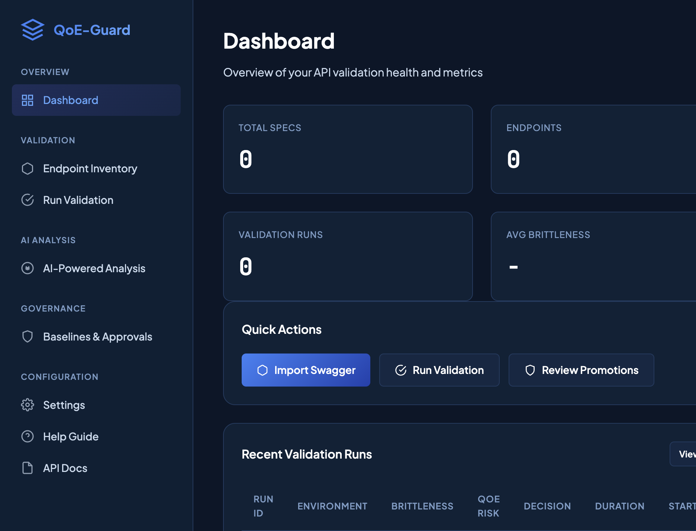

### Overview

The Dashboard provides a high-level view of your API validation health and metrics:

| Metric | Description |
|--------|-------------|
| **Total Specs** | Number of OpenAPI specifications imported |
| **Endpoints** | Total API endpoints discovered |
| **Validation Runs** | Total validation jobs executed |
| **Avg Brittleness** | Average brittleness score (0-100) |

### Quick Actions

- **Import Swagger** - Add a new OpenAPI specification
- **Run Validation** - Start a validation job
- **Review Promotions** - Check pending baseline approvals

### Recent Validation Runs

A table showing the latest validation results with:
- Run ID, Environment, Brittleness score, QoE Risk score, Decision (PASS/WARN/FAIL), Duration

---

## 2. Endpoint Inventory

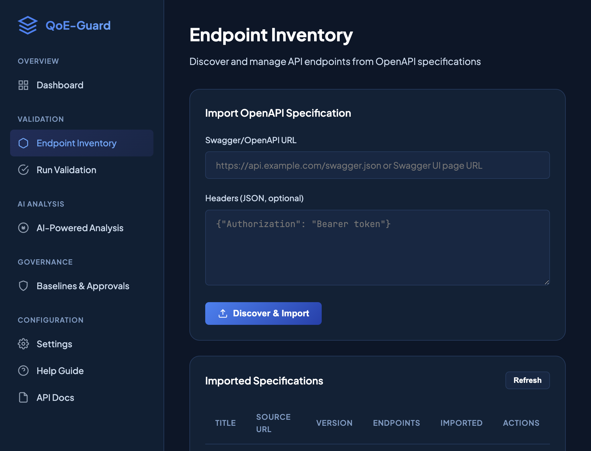

### Import OpenAPI Specification

Enter a Swagger/OpenAPI URL to discover and import endpoints:

1. **Swagger/OpenAPI URL** - Direct JSON/YAML URL or Swagger UI page
2. **Headers (JSON)** - Optional authentication headers

**Supported formats:**
```
https://api.example.com/openapi.json
https://api.example.com/v3/api-docs
https://petstore3.swagger.io/api/v3/openapi.json
```

### Imported Specifications

A table listing all imported specs with title, source URL, version, endpoint count, import date, and actions.

---

## 3. AI-Powered Analysis

The AI Analysis module provides six powerful analysis tools powered by LLMs and ML:

### 3.1 LLM Diff Analysis


Use large language models to analyze API changes:

- **Groq (Llama)** - Fastest inference
- **OpenAI (GPT-4)** - Most comprehensive
- **Claude (Anthropic)** - Best for nuanced explanations

**Features:**
- Natural language explanation of changes
- Breaking vs non-breaking classification
- Impact prediction
- Fix recommendations

### 3.2 Semantic Drift Detection

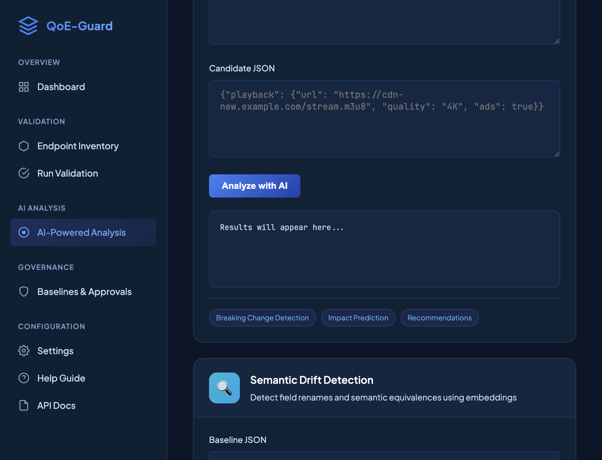

Uses embeddings to detect:
- Field renames (e.g., `playback_url` → `manifest_url`)
- Semantic equivalences (e.g., "HD" ≈ "1080p")
- Meaning changes even when structure is similar

**Configurable similarity threshold** (0.0 - 1.0)

### 3.3 Anomaly Detection


ML algorithms to identify:
- Latency spikes
- Error rate anomalies
- Unusual response patterns

**Algorithms:**
- Isolation Forest (default)
- One-Class SVM
- Local Outlier Factor
- Statistical (Z-Score)

### 3.4 NLP Endpoint Classification

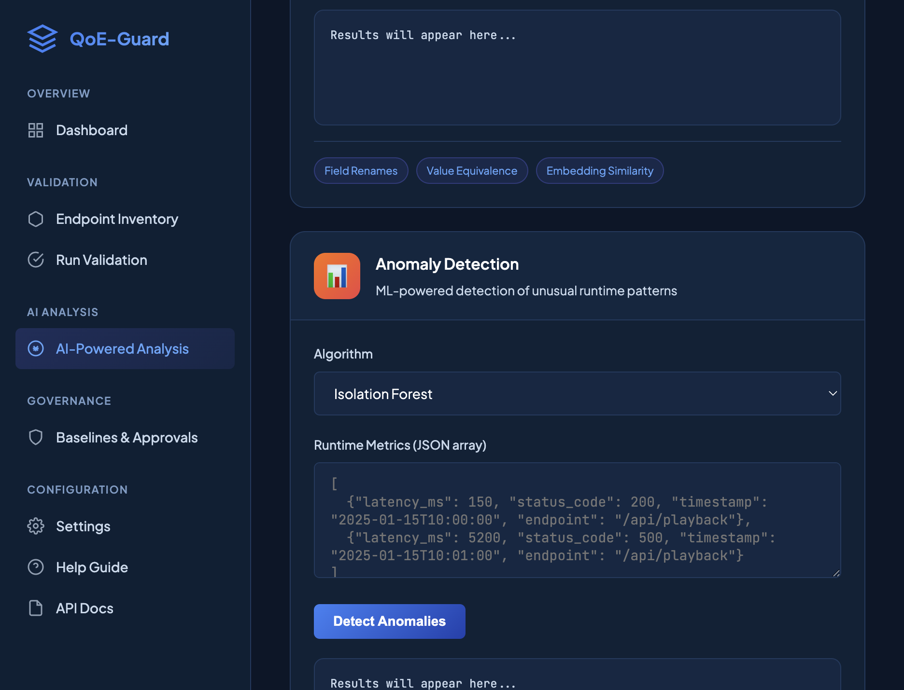

Auto-classify endpoints by:
- **Intent** - playback, auth, metadata, ads
- **Criticality** - critical, high, medium, low
- **QoE Impact** - Effect on user experience

### 3.5 ML Risk Scoring

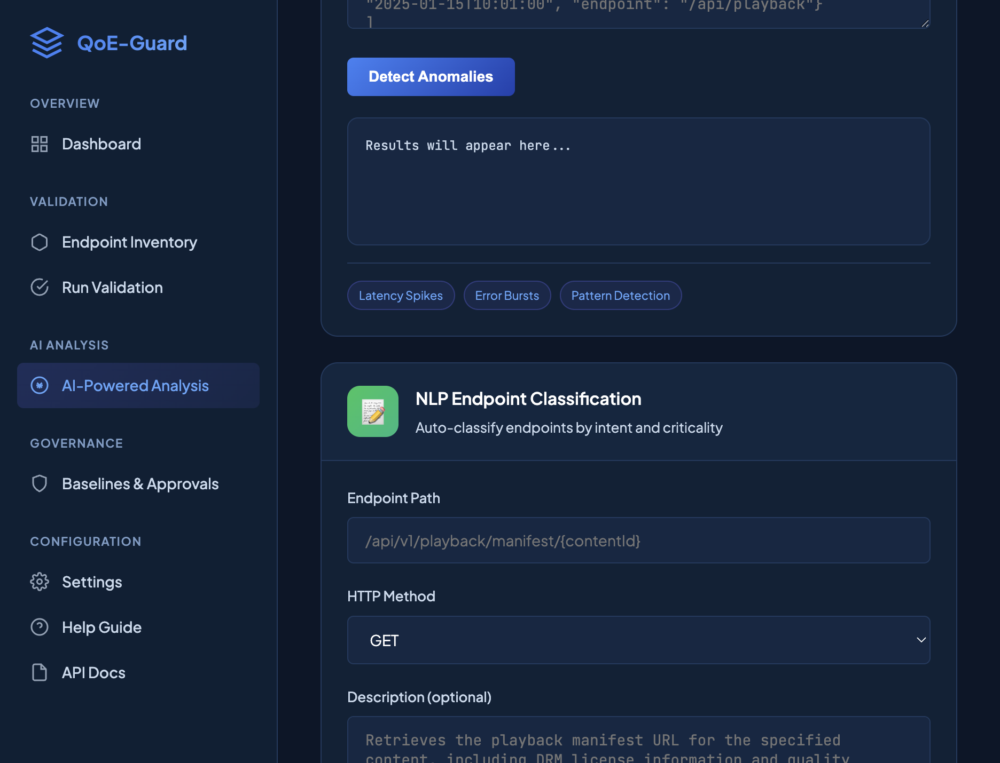
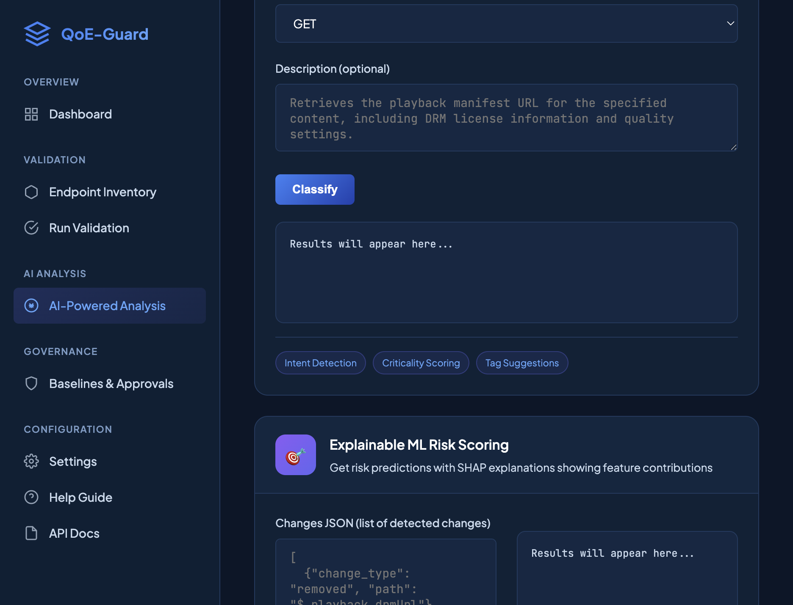

Calculate risk scores with explainability:
- Uses trained XGBoost/LightGBM models
- SHAP-powered feature explanations
- Confidence intervals

---

## 4. Baseline Governance


### Pending Approvals

Review and approve/reject baseline promotion requests:

| Column | Description |
|--------|-------------|
| Scenario | API scenario being promoted |
| Requester | Who requested the promotion |
| Justification | Reason for promotion |
| Stable Runs | Number of stable validation runs |
| QoE Check | Risk assessment passed? |
| Requested | When promotion was requested |

### Policy Configuration

**Thresholds:**
- Brittleness Fail/Warn Thresholds
- QoE Risk Fail/Warn Thresholds

**Override Rules:**
- Fail on critical type change
- Fail on undocumented drift
- Warn on spec drift
- CI hard gate (block on fail)

---

## 5. Settings & Configuration

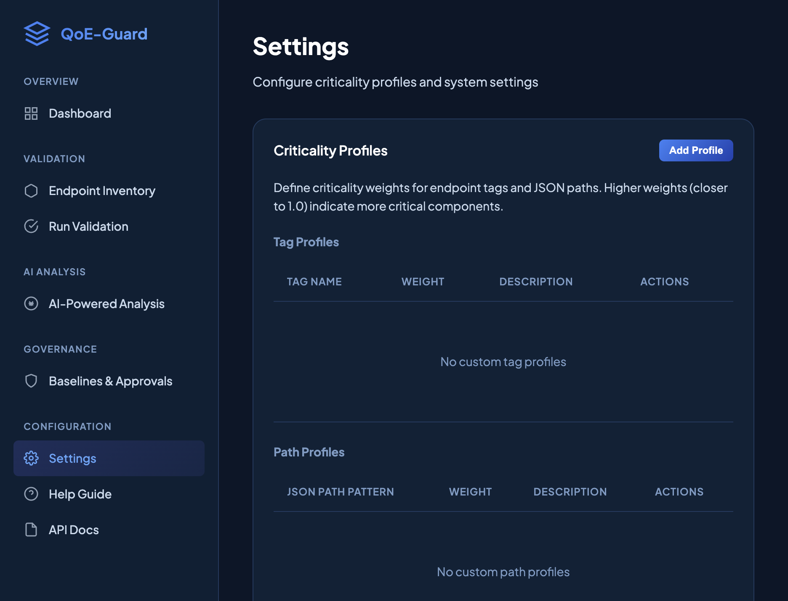

### Criticality Profiles

Define criticality weights for endpoint tags and JSON paths:

| Tag | Weight | Description |
|-----|--------|-------------|
| playback | 1.0 | Critical - affects video playback |
| drm | 0.95 | Critical - content protection |
| auth | 0.8 | High - authentication |
| metadata | 0.4 | Medium - discovery |
| analytics | 0.3 | Low - background |

---

## 6. Help Guide


### Documentation Sections

- 🚀 **Getting Started** - Quick start guide
- 📊 **Dashboard** - Metrics overview
- 📦 **Endpoint Inventory** - Import & manage APIs
- ✅ **Validations** - Running validations
- 🧠 **AI Analysis** - AI/ML features
- 🛡️ **Governance** - Baseline management
- 📈 **Scoring** - Brittleness & QoE scores
- 🔌 **API Reference** - REST API endpoints
- 📋 **Sample Data** - Test data examples
- 🔧 **Troubleshooting** - Common issues

---

## 7. API Documentation (Swagger)

Full interactive API documentation powered by Swagger UI with 60+ endpoints:

### Overview & Key Concepts


**Version:** 1.0.0 (OAS 3.1)

Key features listed: Discovers, Extracts, Generates, Validates, Scores, Classifies, Gates, Governs

### Authentication Endpoints

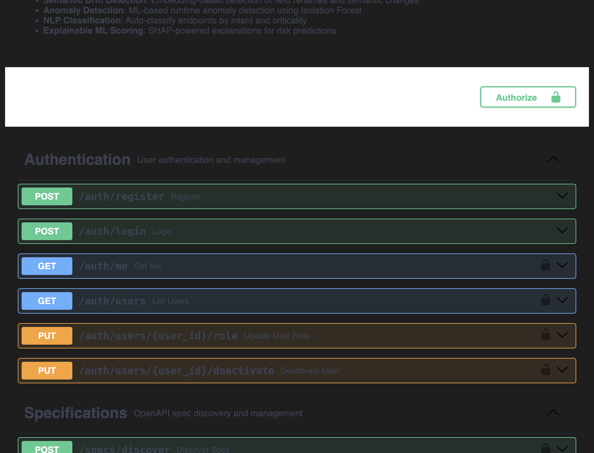

- `POST /auth/register` - Create account
- `POST /auth/login` - Get JWT token
- `GET /auth/me` - Get current user
- `GET /auth/users` - List users
- `PUT /auth/users/{user_id}/role` - Update role
- `PUT /auth/users/{user_id}/deactivate` - Deactivate user

### Specifications & Scenarios

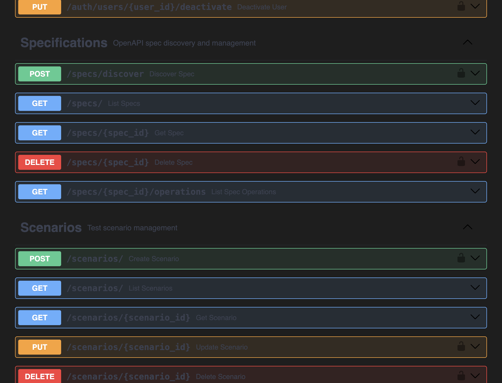

- `POST /specs/discover` - Import OpenAPI spec
- `GET /specs/` - List specs
- `GET /specs/{spec_id}` - Get spec details
- `DELETE /specs/{spec_id}` - Delete spec
- `GET /specs/{spec_id}/operations` - List operations
- CRUD for `/scenarios/*`

### Validations & Governance


- `POST /validations/` - Create validation
- `GET /validations/` - List validations
- `GET /validations/{run_id}` - Get result
- `GET /validations/{run_id}/artifacts` - Get artifacts
- `POST /governance/promotions` - Request promotion
- `GET /governance/promotions/pending` - Pending approvals
- `POST /governance/promotions/{id}/approve` - Approve
- `POST /governance/promotions/{id}/reject` - Reject

### AI Analysis Endpoints

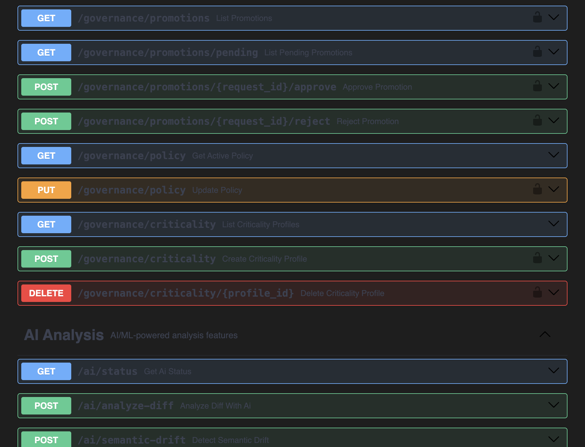

- `GET /ai/status` - AI service status
- `POST /ai/analyze-diff` - LLM diff analysis
- `POST /ai/semantic-drift` - Detect drift
- `POST /ai/detect-anomalies` - Anomaly detection
- `POST /ai/classify-endpoint` - NLP classification
- `POST /ai/ml-score` - ML risk scoring
- `POST /ai/recommendations` - Get recommendations
- `POST /ai/explain-for-stakeholder` - Stakeholder explanations
- `POST /ai/batch-classify` - Batch classification

### Test Data Endpoints

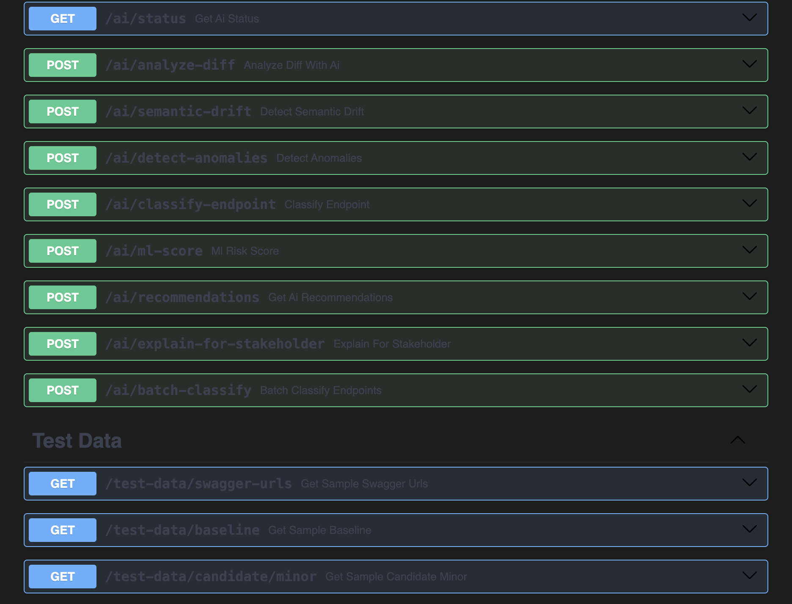

- `GET /test-data/swagger-urls` - Sample Swagger URLs
- `GET /test-data/baseline` - Sample baseline JSON
- `GET /test-data/candidate/minor` - Sample candidate (minor changes)
- `GET /test-data/candidate/breaking` - Sample candidate (breaking changes)
- `GET /test-data/metrics` - Sample runtime metrics

---

## 8. Allure Test Reports

Comprehensive test suite with Allure reporting:

### Test Results Overview


### Test Behaviors (BDD)

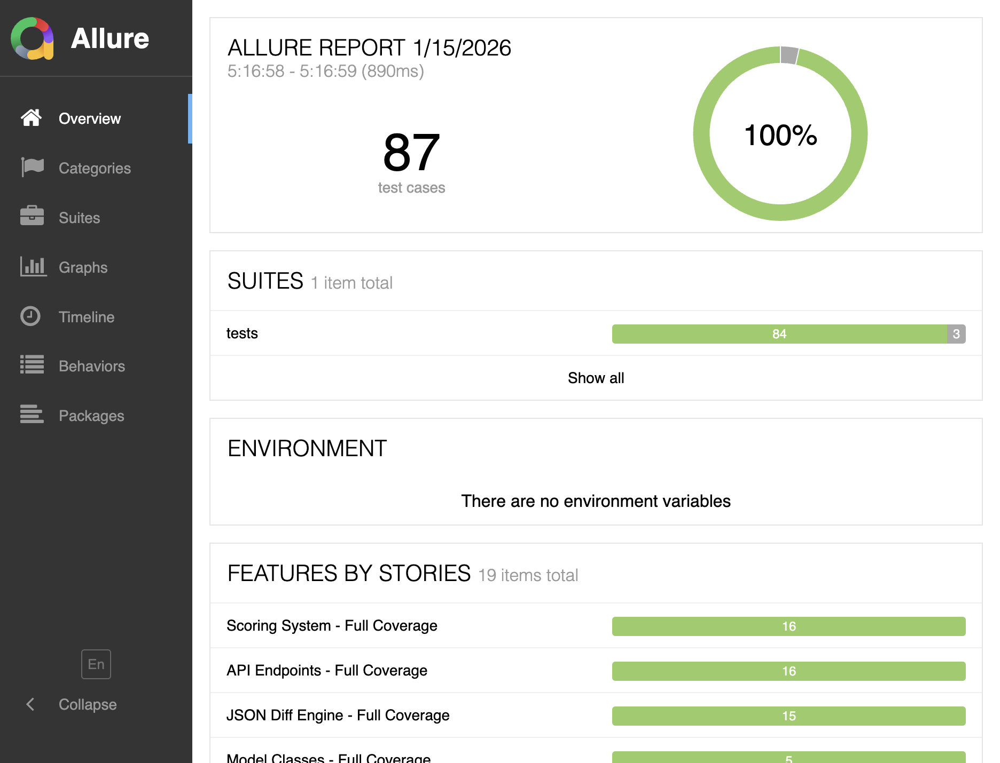

### Test Categories

- **Unit Tests** - Core functionality (diff, scoring, features)
- **Integration Tests** - API endpoints
- **E2E Tests** - Full workflow validation with schema validation

### Report Sections

- **Overview** - Summary dashboard
- **Categories** - Tests grouped by category
- **Suites** - Tests grouped by test file
- **Graphs** - Visual analytics
- **Timeline** - Execution timeline
- **Behaviors** - BDD-style features

---

## Architecture Summary

```
┌─────────────────────────────────────────────────────────────────┐
│                    QoE-Guard Enterprise                         │
├─────────────────────────────────────────────────────────────────┤
│  UI Layer                                                       │
│  ├── Dashboard          - Metrics & quick actions               │
│  ├── Endpoint Inventory - Import & manage OpenAPI specs         │
│  ├── AI Analysis        - LLM, semantic drift, anomaly          │
│  ├── Governance         - Baseline approvals & policies         │
│  ├── Settings           - Criticality profiles                  │
│  └── Help Guide         - Documentation & samples               │
├─────────────────────────────────────────────────────────────────┤
│  API Layer (FastAPI)    - 60+ REST endpoints                    │
│  ├── /specs/*           - OpenAPI discovery & management        │
│  ├── /validations/*     - Run & retrieve validations            │
│  ├── /ai/*              - AI/ML analysis (9 endpoints)          │
│  ├── /governance/*      - Baseline promotion workflow           │
│  ├── /test-data/*       - Sample data for testing               │
│  └── /auth/*            - JWT authentication                    │
├─────────────────────────────────────────────────────────────────┤
│  Core Engine                                                    │
│  ├── JSON Diff          - Hierarchical change detection         │
│  ├── Feature Extraction - Variance feature vectors              │
│  ├── Scoring            - Brittleness & QoE risk                │
│  ├── Policy Engine      - PASS/WARN/FAIL decisions              │
│  └── Drift Classifier   - Spec vs runtime drift                 │
├─────────────────────────────────────────────────────────────────┤
│  AI/ML Module                                                   │
│  ├── LLM Analyzer       - Groq/OpenAI/Claude                    │
│  ├── Semantic Drift     - Sentence transformers                 │
│  ├── Anomaly Detector   - Isolation Forest/SVM/LOF              │
│  ├── NLP Classifier     - spaCy/KeyBERT                         │
│  └── ML Scorer          - XGBoost/SHAP                          │
└─────────────────────────────────────────────────────────────────┘
```

---

## Quick Start

```bash
# 1. Clone the repository
git clone https://github.com/parthassamal/qoe-guard-patent-demo.git
cd qoe-guard-patent-demo

# 2. Create virtual environment
python3 -m venv .venv && source .venv/bin/activate

# 3. Install dependencies
pip install -r requirements.txt

# 4. Start the server
python -m qoe_guard.main

# 5. Open in browser
open http://localhost:8010
```

---

## Screenshot Index

| # | File | Description |
|---|------|-------------|
| 01 | `01-dashboard.png` | Main dashboard with metrics |
| 02 | `02-inventory.png` | Endpoint inventory & import |
| 03 | `03-ai-llm-analysis.png` | LLM diff analysis with Groq/OpenAI/Claude |
| 04 | `04-ai-semantic-drift.png` | Semantic drift detection |
| 05 | `05-ai-anomaly-detection.png` | ML anomaly detection |
| 06 | `06-ai-nlp-classification.png` | NLP endpoint classification |
| 07 | `07-ai-ml-scoring.png` | ML-based risk scoring |
| 08 | `08-ai-ml-risk-score.png` | SHAP-powered explanations |
| 09 | `09-governance.png` | Baseline governance & approvals |
| 10 | `10-settings.png` | Settings & criticality profiles |
| 11 | `11-help.png` | Help guide & documentation |
| 12 | `12-swagger-header.png` | API docs header & overview |
| 13 | `13-swagger-auth.png` | Authentication endpoints |
| 14 | `14-swagger-specs.png` | Specs & scenarios endpoints |
| 15 | `15-swagger-validations.png` | Validations & governance endpoints |
| 16 | `16-swagger-ai.png` | AI analysis endpoints |
| 17 | `17-swagger-test-data.png` | Test data endpoints |
| 18 | `18-allure-overview.png` | Allure test report overview |
| 19 | `19-allure-behaviors.png` | Allure behaviors/BDD view |

---

## License

Patent-pending technology. All rights reserved.

**Inventors:** |Deepti Shoemaker| Partha Sarathi Samal| Suresh Kumar Palus|
**Date:** January 2026
