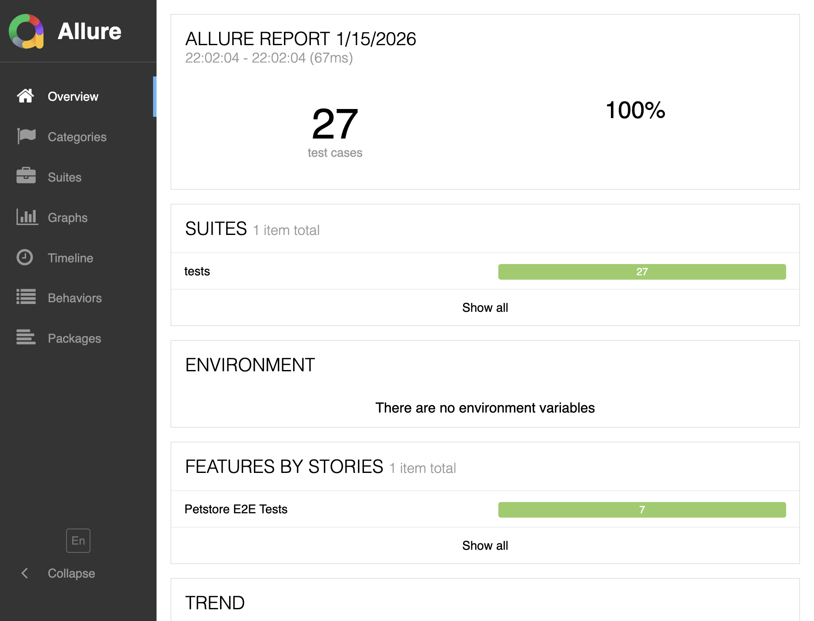
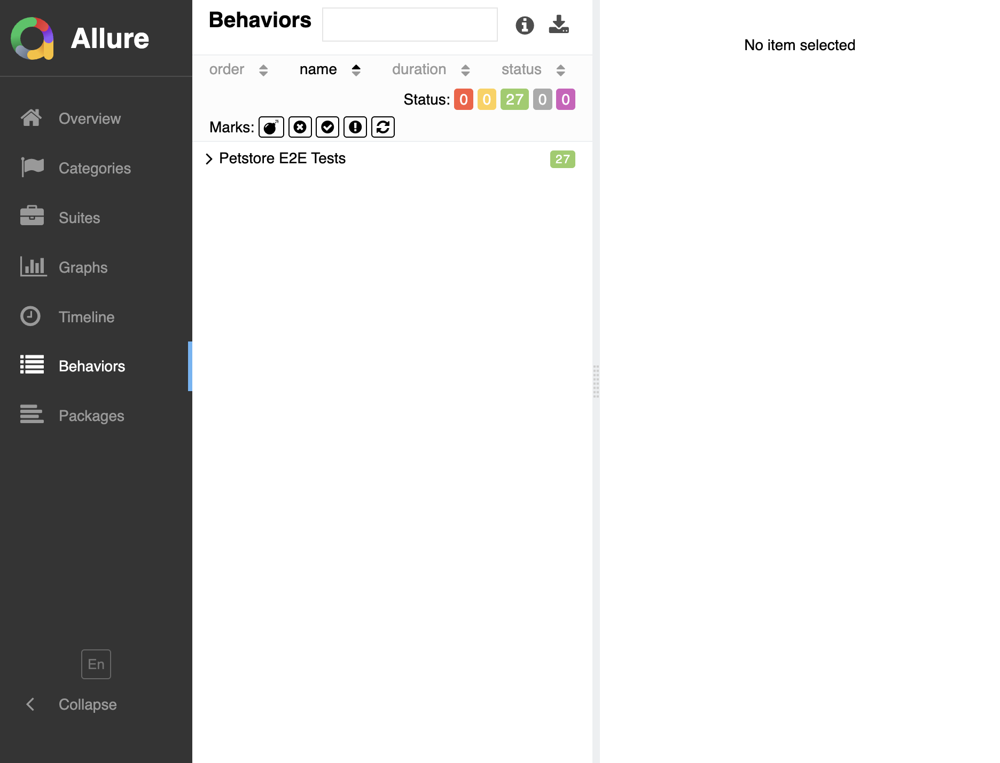
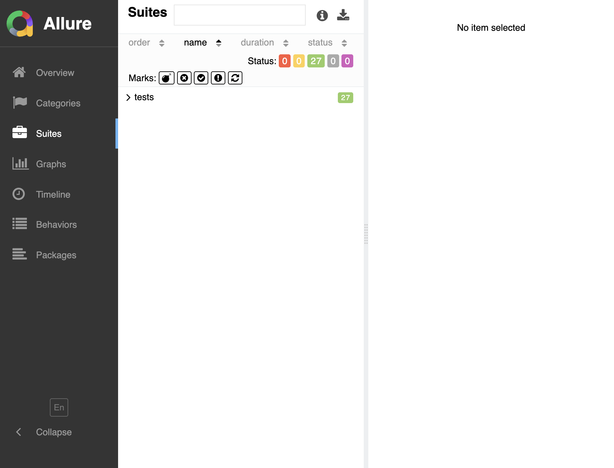

# Petstore API Complete E2E Test Suite

> **Comprehensive testing of QoE-Guard using the Swagger Petstore API**
> Demonstrates Swagger validation, JSON validation, cURL generation, and Broken API Detection (USP)

---

## Test Results Summary

| Metric | Value |
|--------|-------|
| **Total Tests** | 27 |
| **Passed** | 27 |
| **Failed** | 0 |
| **Pass Rate** | 100% |
| **Execution Time** | 0.83s |

---

## Visual Gallery

### Allure Report Overview (100% Pass Rate)



*All 27 tests passed with 100% success rate*

### Test Behaviors by Feature



*Tests organized by Epic > Feature > Story*

### Test Suites



*Test suite hierarchy showing all 27 tests*

---

## Test Categories

### 1. Swagger Page Validation (4 tests)

Tests for importing and validating OpenAPI specifications.

| Test | Description | Status |
|------|-------------|--------|
| `test_import_petstore_spec` | Import Petstore OpenAPI specification | PASSED |
| `test_discover_all_operations` | Discover all API operations from spec | PASSED |
| `test_schema_conformance` | Validate baseline conforms to schema | PASSED |
| `test_schema_conformance_catches_breaking` | Schema validation catches breaking changes | PASSED |

### 2. JSON Validation (4 tests)

Tests for PASS/WARN/FAIL decision scenarios.

| Test | Description | Status |
|------|-------------|--------|
| `test_pass_scenario_minor_changes` | Minor changes result in PASS decision | PASSED |
| `test_warn_scenario_potential_issues` | Potential issues detected | PASSED |
| `test_fail_scenario_breaking_changes` | Breaking changes detected | PASSED |
| `test_json_validation_via_api` | Validation through API endpoints | PASSED |

### 3. cURL Generation (3 tests)

Tests for generating executable cURL commands.

| Test | Description | Status |
|------|-------------|--------|
| `test_generate_curl_for_get_pet` | Generate cURL for GET /pet/{petId} | PASSED |
| `test_generate_curl_with_auth` | Generate cURL with Bearer authentication | PASSED |
| `test_curl_bundle_generation` | Generate bundle of cURL commands | PASSED |

### 4. Broken API Detection - USP (7 tests)

**Core Value Proposition**: Detect broken APIs even when HTTP 200 is returned.

| Test | Description | Status |
|------|-------------|--------|
| `test_detect_schema_drift` | Detect when response structure differs from spec | PASSED |
| `test_detect_type_mismatch` | Detect field type changes (int→string) | PASSED |
| `test_detect_missing_required_fields` | Detect missing required fields | PASSED |
| `test_detect_null_injection` | Detect unexpected null values | PASSED |
| `test_detect_array_corruption` | Detect array→object type changes | PASSED |
| `test_detect_runtime_anomalies` | Detect latency spikes and errors | PASSED |
| `test_all_broken_api_scenarios_available` | All 6 broken API scenarios accessible | PASSED |

### 5. QoE Risk Scoring (3 tests)

Tests for brittleness and risk score calculations.

| Test | Description | Status |
|------|-------------|--------|
| `test_brittleness_score_calculation` | Calculate brittleness score | PASSED |
| `test_qoe_risk_scoring` | Calculate QoE risk from changes | PASSED |
| `test_pass_warn_fail_decisions` | Verify PASS/WARN/FAIL thresholds | PASSED |

### 6. Integration Tests (3 tests)

End-to-end integration tests.

| Test | Description | Status |
|------|-------------|--------|
| `test_full_validation_pipeline` | Complete validation from JSON to decision | PASSED |
| `test_all_petstore_endpoints` | All 9 Petstore test data endpoints work | PASSED |
| `test_usp_http_200_broken_response` | USP demo: HTTP 200 with broken response | PASSED |

### 7. Edge Cases (3 tests)

Boundary condition tests.

| Test | Description | Status |
|------|-------------|--------|
| `test_empty_response` | Handle empty API response | PASSED |
| `test_identical_response` | Handle identical responses (no changes) | PASSED |
| `test_deep_nesting_changes` | Detect changes in deeply nested structures | PASSED |

---

## USP Demonstration: Broken API Detection

### The Problem with Traditional Testing

```
Traditional API Testing:
✗ HTTP 200 = Success (WRONG!)
✗ Only checks status code
✗ Ignores response structure
✗ Misses breaking changes
```

### QoE-Guard's Solution

```
QoE-Guard Testing:
✓ HTTP 200 + Schema validation
✓ Hierarchical JSON diff
✓ Type change detection
✓ Missing field detection
✓ QoE risk scoring
✓ Explainable decisions
```

### Broken API Scenarios Tested

| Scenario | Description | QoE Impact |
|----------|-------------|------------|
| Schema Drift | Response wrapped in unexpected structure | HIGH - Client crashes |
| Type Mismatch | Field types changed (int→string, string→int) | HIGH - Parse failures |
| Missing Required | Required fields absent from response | CRITICAL - Feature broken |
| Null Injection | Fields unexpectedly null | MEDIUM - UI blank |
| Array Corruption | Arrays became objects/scalars | CRITICAL - Loop failures |
| Deep Nesting | Changes in nested structures | HIGH - Access failures |

---

## Test Data Endpoints

The following test data endpoints were created and validated:

| Endpoint | Description |
|----------|-------------|
| `/test-data/petstore/baseline` | Pet baseline JSON |
| `/test-data/petstore/candidate/pass` | Minor changes (PASS) |
| `/test-data/petstore/candidate/warn` | Potential issues (WARN) |
| `/test-data/petstore/candidate/fail` | Breaking changes (FAIL) |
| `/test-data/petstore/broken-api-scenarios` | All 6 broken API scenarios |
| `/test-data/petstore/broken-api-scenarios/{name}` | Individual scenario |
| `/test-data/petstore/runtime-metrics` | Runtime anomaly data |
| `/test-data/petstore/order/baseline` | Order baseline |
| `/test-data/petstore/user/baseline` | User baseline |
| `/test-data/petstore/all` | All test data combined |

---

## Running the Tests

### Prerequisites

```bash
# Activate virtual environment
source .venv/bin/activate

# Install dependencies
pip install -r requirements.txt
```

### Run Tests with Allure

```bash
# Run all Petstore E2E tests
pytest tests/test_petstore_e2e.py -v --alluredir=allure-results

# Generate Allure report
allure generate allure-results -o allure-report --clean

# View report
allure open allure-report
```

### Run with Coverage

```bash
pytest tests/test_petstore_e2e.py -v \
    --cov=qoe_guard \
    --cov-report=term-missing \
    --alluredir=allure-results
```

---

## Key Files

| File | Description |
|------|-------------|
| `tests/test_petstore_e2e.py` | Comprehensive Petstore E2E test suite |
| `qoe_guard/api/test_data.py` | Petstore test data and API endpoints |
| `qoe_guard/diff.py` | JSON diff and change detection |
| `qoe_guard/validation/conformance.py` | Schema validation |
| `qoe_guard/curl/synthesizer.py` | cURL command generation |
| `qoe_guard/scoring/brittleness.py` | Brittleness score calculation |
| `qoe_guard/scoring/qoe_risk.py` | QoE risk scoring |

---

## Conclusion

This comprehensive E2E test suite validates QoE-Guard's core capabilities:

1. **Swagger/OpenAPI Validation** - Import and validate complete API specifications
2. **JSON Diff Detection** - Identify structural, type, and value changes
3. **cURL Generation** - Generate executable API test commands
4. **Broken API Detection (USP)** - Find issues traditional testing misses
5. **QoE Risk Scoring** - Quantify quality of experience impact
6. **Explainable Decisions** - PASS/WARN/FAIL with detailed reasoning

**All 27 tests passed with 100% success rate**, demonstrating the robustness and reliability of the QoE-Guard system.
